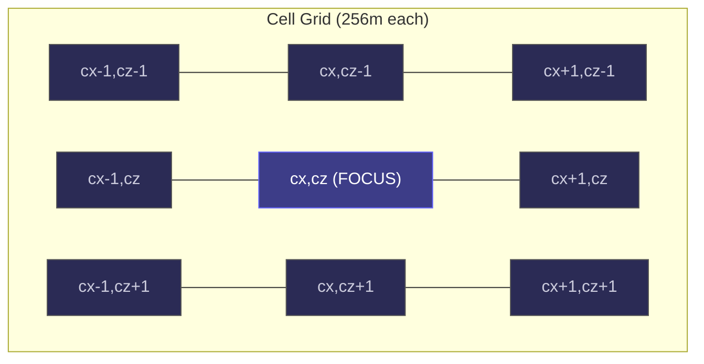
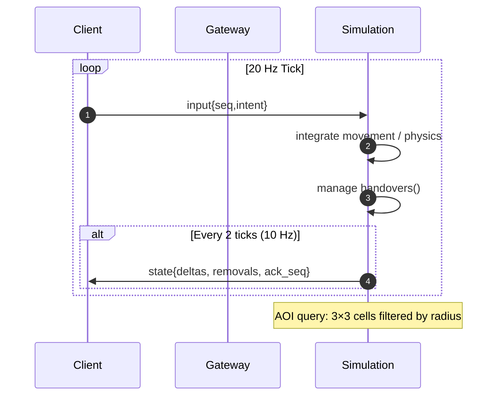
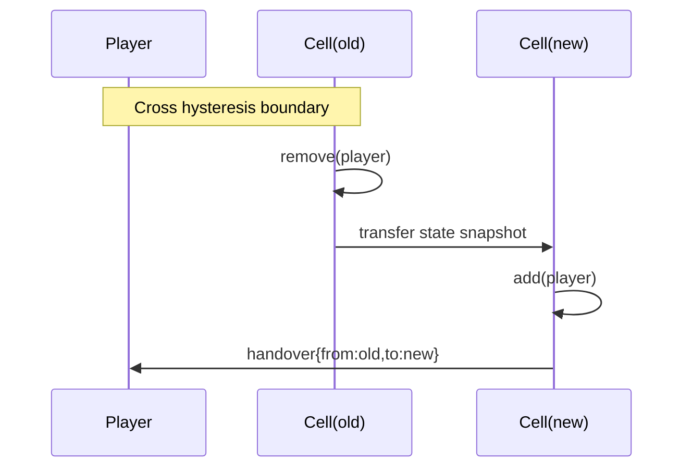

# 🛰️ AstroSteveo

[](https://github.com/astrosteveo)
[](https://github.com/astrosteveo/prototype-game)
[](https://github.com/astrosteveo)
[](https://github.com/astrosteveo)

**Software Engineer** • **Systems Re-Inventor** • **World Model Tinkerer**

*"Reinventing the obvious until it's obviously better."*

## 🌌 Core Identity

I challenge "defaults," especially in spaces that pretend they're solved (static sharding, brittle world partitioning, boilerplate infra). Patterns are raw material; I recombine patterns into infrastructure that disappears for the player but empowers the builder.

> *Architectures should feel inevitable when finished — not when proposed.*

## 🚀 Featured Projects

### 🚧 Flagship: `prototype-game`

R&D playground for a next-gen MMO backend where "Which server are you on?" becomes a deprecated question.

| Dimension | Details |
|-----------|---------|
| **Goal** | Seamless, fluid world state without static shard boundaries |
| **Core Services** | Gateway (auth/session) • Simulation node (state + WebSocket transport) |
| **Transport** | WebSocket (gated via build tags / feature flags) |
| **Design Style** | Cell / region orchestration with adaptive load & continuity |
| **Language Focus** | Go (infra + sim core) with targeted supporting tooling |
| **Documentation** | Rich narrative across:<br/>• [`docs/AGENTS.md`](docs/AGENTS.md)<br/>• [`docs/architecture/technical-design-document.md`](docs/architecture/technical-design-document.md)<br/>• [`docs/development/`](docs/development/)<br/>• [`docs/product/`](docs/product/) |
| **Operations** | Makefile-driven reproducibility; automated local probe flows |
| **Ethos** | *"Treat simulation like living infrastructure; evolve via measurable constraints."* |

#### 🧪 Development Workflow

```bash
make build
make fmt vet test test-ws        # Everything green or no merge
make run                         # Gateway :8080 • Sim :8081
curl :8080/healthz && curl :8081/healthz
TOKEN=$(make login)
make wsprobe TOKEN="$TOKEN"      # Join session + movement simulation
```

**Quality Gate**: *If it can't survive this loop, it doesn't ship.*

## 🏗️ Architecture Overview

### 🧬 Architecture Highlights

*(See full [Technical Design Document](docs/architecture/technical-design-document.md) for deep detail.)*

1. **Gateway** = stateless front door (auth/session). **Simulation** = authoritative tick + AOI + handover
2. **256m cells**, **128m AOI radius**, hysteresis for stable handovers
3. **20 Hz tick** integration, **10 Hz replication** deltas
4. Early intentional cell semantics → future multi-node scaling is a mechanical extension
5. Systems (inventory, skills, targeting) piggy-back on the same replication delta pipeline
6. Bots maintain density to keep the world "breathing"
7. **Observability first**: tick cost, snapshot size, AOI density, handover latency
8. Performance budgets define acceptance—not vibes

> *"Strategic scaffolding" beats premature abstraction.*

### 🛠️ Project Milestones


*Legend: green=completed, yellow=in progress, lightgrey=planned*

### 🧯 Performance Targets

| Metric | Target | Status |
|--------|--------|--------|
| Tick time (200 AOI entities) | < 25ms | 🟢 |
| Local handover latency | < 250ms | 🟡 |
| Cross-node handover (future) | < 500ms | ⚪ |
| Average bandwidth per client | < 30KB/s | 🟢 |
| Snapshot timing jitter | ±20ms | 🟢 |
| Handover duplication events | 0 over soak test | 🟡 |

## 🧩 Architecture Diagrams

### World Partition & AOI Window


```mermaid
flowchart TB
  subgraph "Cell Grid (256m each)"
    A1["cx-1,cz-1"] --- A2["cx,cz-1"] --- A3["cx+1,cz-1"]
    B1["cx-1,cz"]  --- B2["cx,cz (FOCUS)"] --- B3["cx+1,cz"]
    C1["cx-1,cz+1"] --- C2["cx,cz+1"] --- C3["cx+1,cz+1"]
  end

  class A1,A2,A3,B1,B3,C1,C2,C3 cell;
  class B2 focus;

  classDef cell fill:#2b2b55,stroke:#555,color:#ccd;
  classDef focus fill:#3d3d88,stroke:#66f,color:#fff;
```

### Tick & Replication Pipeline


```mermaid
sequenceDiagram
  autonumber
  participant C as Client
  participant G as Gateway
  participant S as Simulation
  loop 20 Hz Tick
    C->>S: input{seq,intent}
    S->>S: integrate movement / physics
    S->>S: manage handovers()
    alt Every 2 ticks (10 Hz)
      S->>C: state{deltas, removals, ack_seq}
    end
  end
  note over S: AOI query: 3×3 cells filtered by radius
```

### Local Handover Process


```mermaid
sequenceDiagram
  participant P as Player
  participant Old as Cell(old)
  participant New as Cell(new)
  Note over P,Old: Cross hysteresis boundary
  Old->>Old: remove(player)
  Old->>New: transfer state snapshot
  New->>New: add(player)
  New->>P: handover{from:old,to:new}
```

## 🧭 Engineering Principles

- **Reinvent where leverage compounds**; defer where commodity is fine
- **Composable primitives** > "God engines"
- **Developer experience is throughput**, not garnish
- **World state is an ecosystem**: observe → adapt → rebalance
- **Documentation precedes code** when complexity is systemic

## 🔄 Why Reinvention?

> *"There's always more robust libraries, etc — so if you aren't reinventing the wheel, you're probably already behind."*

Reinvention here isn't novelty chasing; it's removing constraints inherited from assumptions of older hardware, networking, and monolith-era mental models.

## 🧠 Technology Stack

```text
Core Languages:   Go • Java • Rust • TypeScript • React
Backend:          Quarkus (select JVM services) • WebSocket-driven channels
Infrastructure:   Nix(OS) • K8s evolution • Makefile orchestration
Patterns:         Region/cell partitioning • Adaptive load routing • Real-time sync
Focus Areas:      State streaming • Low-latency simulation • Mutation-safe evolution
```

## 🛰️ Repository Ecosystem

| Repository | Purpose | Status |
|------------|---------|--------|
| [`prototype-game`](https://github.com/astrosteveo/prototype-game) | Core experimental MMO infrastructure & simulation stack | 🟢 Active |
| [`k8s-infra`](https://github.com/astrosteveo/k8s-infra) | Infrastructure evolution for running prototype at scale | 🟡 Developing |
| [`nixos-config`](https://github.com/astrosteveo/nixos-config) | Curated NixOS environment - reproducible workstation setup | 🟢 Active |
| [`fleetforge`](https://github.com/astrosteveo/fleetforge) | Modern project template with awesome-copilot integration | 🟢 Active |
| [`agents.md`](https://github.com/astrosteveo/agents.md) | Knowledge + control surface for automated operational agents | 🟡 Developing |

*Each repository maintains its own narrative; maturity determines visibility.*

## 🧩 Future Deep Dives

*Topics for potential expansion when bandwidth allows:*

- Cell handover + continuity guarantees
- Observability & health surfaces (latency ceilings, partition pressure)
- World scaling economics vs. traditional shard splits
- Nix + K8s pipeline for simulation-driven iteration loops

## ☄️ Philosophy & Flavor

| Theme | Description |
|-------|-------------|
| **Motto** | *"Worlds aren't hosted. They're cultivated."* |
| **Vibe** | Playfully serious systems engineering |
| **Superpower** | Converting fuzzy architectural intent into runnable scaffolds |
| **Core Question** | *"How invisible can infrastructure become before it's pure design space?"* |

## 🤝 Collaboration

**Interested in discussing:**
- Distributed simulation & state continuity
- Unshardable or fluid world models
- Tooling that reduces cognitive residue
- Experiment-first architecture

**Get Involved:**
- Open a discussion in [`prototype-game`](https://github.com/astrosteveo/prototype-game/discussions) for technical topics
- Submit well-formed issues in [`k8s-infra`](https://github.com/astrosteveo/k8s-infra/issues) for infrastructure questions
- Check out [`fleetforge`](https://github.com/astrosteveo/fleetforge) for modern project templates

---

*README = living system. Refactor without apology.*